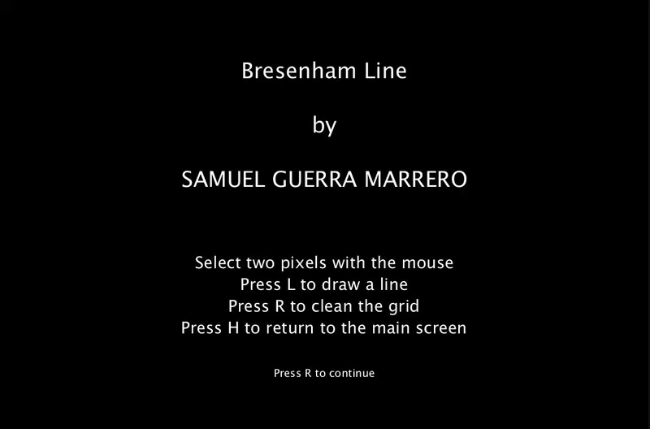

# BresenhamLine
Bresenham's line algorithm is a line drawing algorithm that determines the points of an n-dimensional raster that should be selected in order to form a close approximation to a straight line between two points

## How to use
- Use the mouse to select two pixels in the grid.
- Use L to draw a line.
- Use R key to clean the grid.
- Use H to return to the main screen.

## Referencies

[Bresenham's line algorithm](https://en.wikipedia.org/wiki/Bresenham%27s_line_algorithm).
